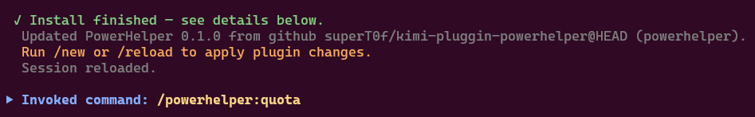
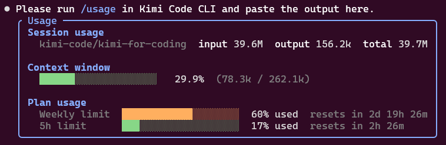
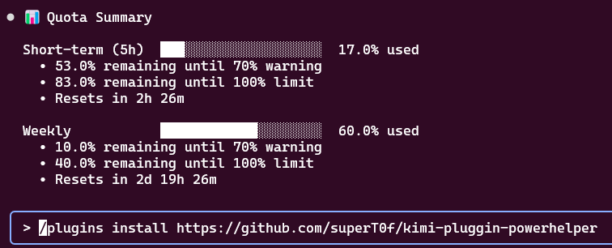
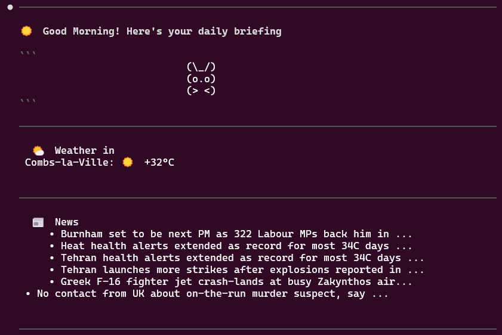
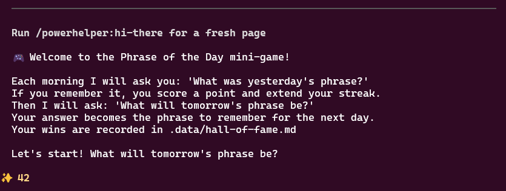
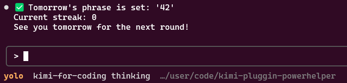
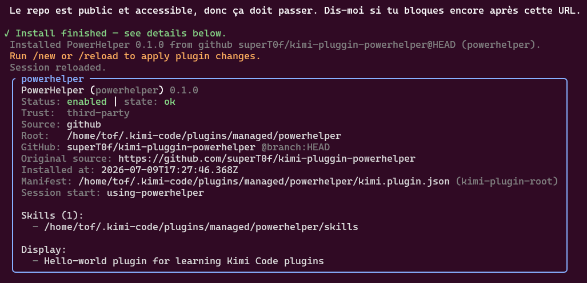

# PowerHelper — Kimi Code CLI Hello-World Plugin

A minimal custom plugin for [Kimi Code CLI](https://www.kimi.com/code/) to learn the plugin system. It bundles:

- an **Agent Skill** loaded automatically at session start;
- a **slash command** you can trigger manually;
- a **daily terminal dashboard** Skill/command (`hi-there`);
- a **quota watcher** that alerts on token usage thresholds;
- an **rtk CLI proxy** integration to keep noisy shell output compact.

## What is a Kimi Code plugin?

A plugin is a directory (or zip) that contains a manifest and optional resources:

- `kimi.plugin.json` — the manifest that describes the plugin.
- `SKILL.md` files — reusable instructions the model can invoke automatically or on demand.
- `commands/*.md` files — prompt templates exposed as `/plugin:command` slash commands.
- optional `mcpServers` for real tools, or `hooks` for lifecycle events.

## Repository structure

```
kimi-pluggin-powerhelper/
├── README.md
├── kimi.plugin.json
├── skills/
│   ├── using-powerhelper/
│   │   └── SKILL.md
│   ├── hi-there/
│   │   └── SKILL.md
│   ├── quota-watch/
│   │   └── SKILL.md
│   └── rtk/
│       └── SKILL.md
├── commands/
│   ├── hello.md
│   ├── hi-there.md
│   ├── quota.md
│   └── rtk.md
├── screens/
│   ├── 1.png
│   ├── 2.png
│   ├── 3.png
│   ├── 4.png
│   └── quota-check/
│       ├── 1.png
│       ├── 2.png
│       └── 3.png
└── tools/
    ├── hi-there.py
    └── quota.py
```

## Installation

### From a local directory

Inside Kimi Code CLI, run:

```
/plugins install ./kimi-pluggin-powerhelper
```

Then reload the session:

```
/reload
```

### From GitHub

```
/plugins install https://github.com/superT0f/kimi-pluggin-powerhelper
```

Then reload:

```
/reload
```

## Usage

### Auto-loaded Skill

Once the plugin is enabled, greet Kimi Code:

```
hello
```

It should reply:

```
Hello, World! from PowerHelper 👋
```

### Slash command

Run the command explicitly:

```
/powerhelper:hello
```

## Verification

Check the plugin diagnostics:

```
/plugins info powerhelper
```

A correct install shows no manifest errors.

## Commands overview

| Command | Trigger | What it does |
|---|---|---|
| `/powerhelper:hello` | `hello`, `hi`, `salut` | Greets you with the plugin's hello-world message. |
| `/powerhelper:hi-there` | `good morning` | Shows the daily terminal dashboard (weather, news, ASCII meme, Phrase of the Day). |
| `/powerhelper:dungeon` | `play dungeon` | Launches the `tcod` terminal arena mini-game. |
| `/powerhelper:quota` | `quota`, `usage` | Parses `/usage` output and shows a graphical quota summary + threshold alerts. |
| `/powerhelper:rtk` | `rtk <command>` | Runs a shell command through the rtk proxy for compact, context-friendly output. |

## `hi-there` daily dashboard + Phrase of the Day game

A terminal dashboard that shows:

- an ASCII meme;
- the current weather in Combs-la-Ville (customizable);
- a short list of public news headlines;
- a 24-hour local cache to avoid repeated network calls;
- the **Phrase of the Day** mini-game.

### Dashboard usage

```text
/powerhelper:hi-there
```

Or simply say:

```text
good morning
```

To use a different location:

```text
/skill:hi-there Paris
```

### Player profile

The first time you run `hi-there`, the assistant asks a few profile questions before showing the dashboard. The questions are driven by `.data/player.md`, so you can add new fields later; the assistant will ask for any new required field on the next run.

Supported field types:

| type | usage |
|---|---|
| `text` | free text answer |
| `number` | numeric answer, can be optional |
| `yes/no` | boolean answer |
| `enum:a,b,c` | choose one of the listed options |

Current fields:

- **pseudo** — free text
- **gender** — free text (LGBTQA+ friendly)
- **age** — optional number
- **style** — `serious`, `relaxed` or `casual`
- **theme** — `light` or `dark`

Your answers are stored locally in `.data/player.json` and shown in the dashboard header.

### Phrase of the Day game

Each day the Skill asks:

1. "What was yesterday's phrase?"
2. "What will tomorrow's phrase be?"

If you remember yesterday's phrase, your streak increases and your win is recorded in `.data/hall-of-fame.md`.

#### First day

On the first run, the game is explained in English and you are asked to set tomorrow's phrase directly.

#### Example flow

```text
good morning
# dashboard + "What was yesterday's phrase?"

the early bird catches the worm
# "Correct! Streak: 3" + "What will tomorrow's phrase be?"

a journey of a thousand miles begins with a single step
# "Tomorrow's phrase is set. See you tomorrow!"
```

### Requirements

- Python 3 must be installed and on `PATH`.
- Network access to `wttr.in` and `feeds.bbci.co.uk` (only on the first dashboard run of the day, or when the cache is stale).

### Cache

The dashboard cache lives at `~/.cache/powerhelper/hi-there.json`.
The game state lives at `~/.cache/powerhelper/hi-there-game.json`.
The player profile values live at `.data/player.json`.
All are refreshed automatically.

## RTK CLI proxy integration

PowerHelper integrates [rtk](https://github.com/rtk-ai/rtk) to keep long or noisy shell output compact before it enters the Kimi Code context window.

### Usage

Run any command through rtk with the slash command:

```text
/powerhelper:rtk ls -la
```

Or invoke the `rtk` skill implicitly by asking for a command that usually produces a lot of output:

```text
show me the git log
```

The assistant will use `rtk git log` instead of raw `git log`.

### Supported mappings

| Native | RTK equivalent |
|---|---|
| `ls`, `tree`, `find` | `rtk ls`, `rtk tree`, `rtk find` |
| `git ...` | `rtk git ...` |
| `npm run`, `pnpm`, `npx` | `rtk npm run`, `rtk pnpm`, `rtk npx` |
| `pytest`, `jest`, `vitest` | `rtk pytest`, `rtk jest`, `rtk vitest` |
| `tsc`, `eslint`, `prettier` | `rtk tsc`, `rtk lint`, `rtk prettier` |
| `docker`, `kubectl` | `rtk docker`, `rtk kubectl` |
| arbitrary long command | `rtk summary "<command>"` |
| full raw output | `rtk run "<command>"` |

### Requirements

- rtk must be installed and available at `/home/tof/.local/bin/rtk` (or on `PATH`).

## Dungeon Arena mini-game

A D&D-style arena brawler powered by [python-tcod](https://python-tcod.readthedocs.io/).

### Installation

Dungeon Arena requires `python-tcod`:

```bash
pip install tcod
```

### Launch

```text
/powerhelper:dungeon
```

Or say:

```text
play dungeon
```

### Goal

Survive waves of monsters in a single-room dungeon. Earn XP, level up, and improve your STR, DEX, and CON stats. Stats are stored in `.data/player.json` and displayed in the `hi-there` dashboard.

## Quota Watcher

Keep an eye on your Kimi Code CLI token budget. PowerHelper parses the output of `/usage`, shows a compact graphical summary, and alerts you when you cross the 70% warning line, then again at every 5% step (75%, 80%, 85% …).

### Usage

Run in Kimi Code CLI:

```text
/usage
```

Then paste the output after the slash command:

```text
/powerhelper:quota ╭ Usage ───────────────────────────────────────────────╮
...
```

Or simply say a keyword and the assistant will ask for the `/usage` output:

```text
quota
```

### What you get back

A visual summary for both quota windows with usage bars, headroom before the 70% warning, headroom before the 100% limit, and the time until the next reset:

```text
📊 Quota Summary

Short-term (5h)  ███░░░░░░░░░░░░░░░░░  17.0% used
  • 53.0% remaining until 70% warning
  • 83.0% remaining until 100% limit
  • Resets in 2h 26m

Weekly           ████████████░░░░░░░░  60.0% used
  • 10.0% remaining until 70% warning
  • 40.0% remaining until 100% limit
  • Resets in 2d 19h 26m
```

If a new threshold is crossed, an alert is also printed and recorded.

### Automatic reminders

- **Session start**: if a quota alert is still active, PowerHelper reminds you immediately.
- **Every 10 turns**: a gentle tip reminds you to run `/usage` and check your quota.

### Storage

Quota alert history and turn counters are stored in `.data/quota-alerts.json`.

### Screenshots

#### Invoking the quota command



#### Pasting the `/usage` panel when asked



#### Graphical quota summary



## Screenshots

### Daily dashboard (`good morning`)



### Phrase of the Day — first-run explanation



### Setting tomorrow's phrase



### Installing from GitHub and verifying the plugin



### Quota Watcher

#### Invoking the quota command


#### Pasting the `/usage` panel when asked


#### Graphical quota summary


## Resources

- [Plugins documentation](https://www.kimi.com/code/docs/en/kimi-code-cli/customization/plugins.html)
- [Skills documentation](https://www.kimi.com/code/docs/en/kimi-code-cli/customization/skills.html)
